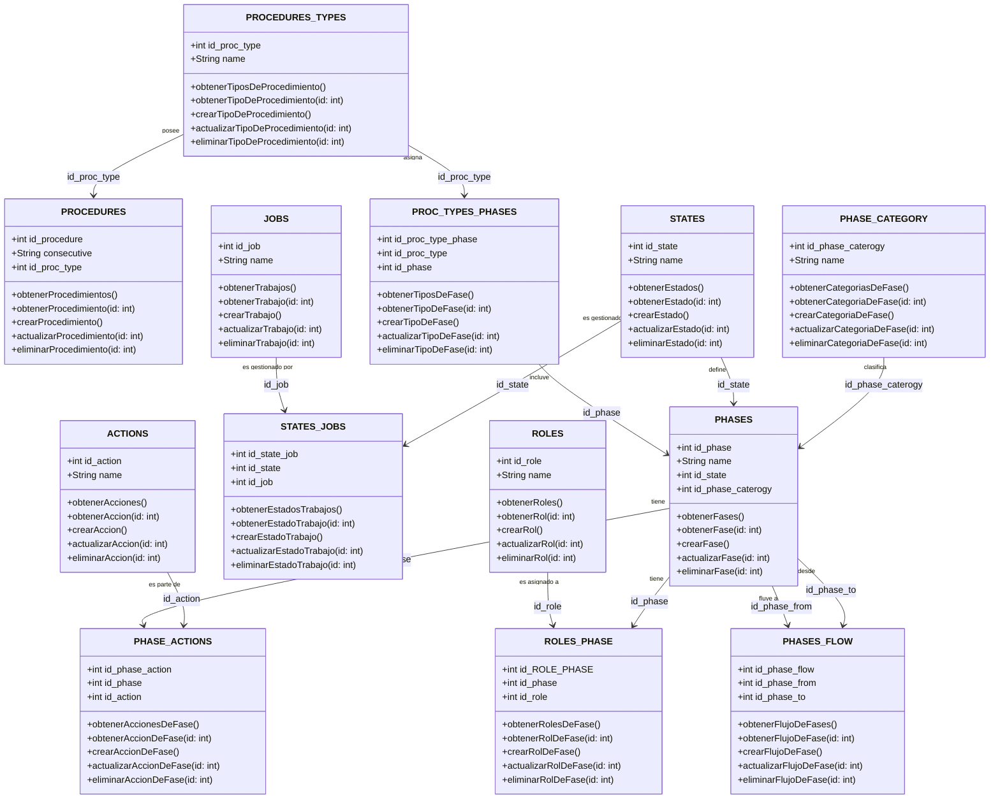
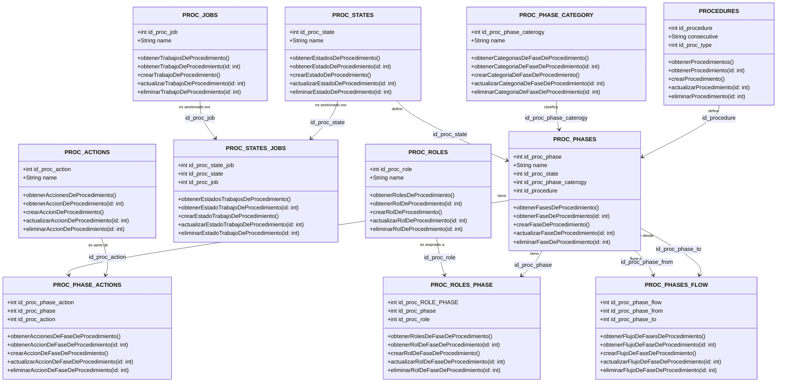

# PROCESOS

## Diagrama de clases (PARAMETRIZACION)

```mermaid
classDiagram
    class PROCEDURES {
        +int id_procedure
        +String consecutive
        +int id_proc_type
        +obtenerProcedimientos()
        +obtenerProcedimiento(id: int)
        +crearProcedimiento()
        +actualizarProcedimiento(id: int)
        +eliminarProcedimiento(id: int)
    }
    class PROCEDURES_TYPES {
        +int id_proc_type
        +String name
        +obtenerTiposDeProcedimiento()
        +obtenerTipoDeProcedimiento(id: int)
        +crearTipoDeProcedimiento()
        +actualizarTipoDeProcedimiento(id: int)
        +eliminarTipoDeProcedimiento(id: int)
    }
    class PROC_TYPES_PHASES {
        +int id_proc_type_phase
        +int id_proc_type
        +int id_phase
        +obtenerTiposDeFase()
        +obtenerTipoDeFase(id: int)
        +crearTipoDeFase()
        +actualizarTipoDeFase(id: int)
        +eliminarTipoDeFase(id: int)
    }
    class ROLES {
        +int id_role
        +String name
        +obtenerRoles()
        +obtenerRol(id: int)
        +crearRol()
        +actualizarRol(id: int)
        +eliminarRol(id: int)
    }
    class STATES {
        +int id_state
        +String name
        +obtenerEstados()
        +obtenerEstado(id: int)
        +crearEstado()
        +actualizarEstado(id: int)
        +eliminarEstado(id: int)
    }
    class JOBS {
        +int id_job
        +String name
        +obtenerTrabajos()
        +obtenerTrabajo(id: int)
        +crearTrabajo()
        +actualizarTrabajo(id: int)
        +eliminarTrabajo(id: int)
    }
    class STATES_JOBS {
        +int id_state_job
        +int id_state
        +int id_job
        +obtenerEstadosTrabajos()
        +obtenerEstadoTrabajo(id: int)
        +crearEstadoTrabajo()
        +actualizarEstadoTrabajo(id: int)
        +eliminarEstadoTrabajo(id: int)
    }
    class PHASES {
        +int id_phase
        +String name
        +int id_state
        +int id_phase_caterogy
        +obtenerFases()
        +obtenerFase(id: int)
        +crearFase()
        +actualizarFase(id: int)
        +eliminarFase(id: int)
    }
    class PHASE_CATEGORY {
        +int id_phase_caterogy
        +String name
        +obtenerCategoriasDeFase()
        +obtenerCategoriaDeFase(id: int)
        +crearCategoriaDeFase()
        +actualizarCategoriaDeFase(id: int)
        +eliminarCategoriaDeFase(id: int)
    }
    class ACTIONS {
        +int id_action
        +String name
        +obtenerAcciones()
        +obtenerAccion(id: int)
        +crearAccion()
        +actualizarAccion(id: int)
        +eliminarAccion(id: int)
    }
    class PHASE_ACTIONS {
        +int id_phase_action
        +int id_phase
        +int id_action
        +obtenerAccionesDeFase()
        +obtenerAccionDeFase(id: int)
        +crearAccionDeFase()
        +actualizarAccionDeFase(id: int)
        +eliminarAccionDeFase(id: int)
    }
    class ROLES_PHASE {
        +int id_ROLE_PHASE
        +int id_phase
        +int id_role
        +obtenerRolesDeFase()
        +obtenerRolDeFase(id: int)
        +crearRolDeFase()
        +actualizarRolDeFase(id: int)
        +eliminarRolDeFase(id: int)
    }
    class PHASES_FLOW {
        +int id_phase_flow
        +int id_phase_from
        +int id_phase_to
        +obtenerFlujoDeFases()
        +obtenerFlujoDeFase(id: int)
        +crearFlujoDeFase()
        +actualizarFlujoDeFase(id: int)
        +eliminarFlujoDeFase(id: int)
    }

    PROCEDURES_TYPES "posee" --> PROCEDURES : id_proc_type
    PROCEDURES_TYPES "asigna" --> PROC_TYPES_PHASES : id_proc_type
    PROC_TYPES_PHASES "incluye" --> PHASES : id_phase
    STATES "define" --> PHASES : id_state
    PHASE_CATEGORY "clasifica" --> PHASES : id_phase_caterogy
    PHASES "tiene" --> PHASE_ACTIONS : id_phase
    ACTIONS "es parte de" --> PHASE_ACTIONS : id_action
    ROLES "es asignado a" --> ROLES_PHASE : id_role
    PHASES "tiene" --> ROLES_PHASE : id_phase
    PHASES "fluye a" --> PHASES_FLOW : id_phase_from
    PHASES "fluye desde" --> PHASES_FLOW : id_phase_to
    JOBS "es gestionado por" --> STATES_JOBS : id_job
    STATES "es gestionado por" --> STATES_JOBS : id_state


```

## Diagrama de clases (REGISTROS)

```mermaid
    classDiagram
    class PROCEDURES {
        +int id_procedure
        +String consecutive
        +int id_proc_type
        +obtenerProcedimientos()
        +obtenerProcedimiento(id: int)
        +crearProcedimiento()
        +actualizarProcedimiento(id: int)
        +eliminarProcedimiento(id: int)
    }
    class PROC_ROLES {
        +int id_proc_role
        +String name
        +obtenerRolesDeProcedimiento()
        +obtenerRolDeProcedimiento(id: int)
        +crearRolDeProcedimiento()
        +actualizarRolDeProcedimiento(id: int)
        +eliminarRolDeProcedimiento(id: int)
    }
    class PROC_STATES {
        +int id_proc_state
        +String name
        +obtenerEstadosDeProcedimiento()
        +obtenerEstadoDeProcedimiento(id: int)
        +crearEstadoDeProcedimiento()
        +actualizarEstadoDeProcedimiento(id: int)
        +eliminarEstadoDeProcedimiento(id: int)
    }
    class PROC_JOBS {
        +int id_proc_job
        +String name
        +obtenerTrabajosDeProcedimiento()
        +obtenerTrabajoDeProcedimiento(id: int)
        +crearTrabajoDeProcedimiento()
        +actualizarTrabajoDeProcedimiento(id: int)
        +eliminarTrabajoDeProcedimiento(id: int)
    }
    class PROC_STATES_JOBS {
        +int id_proc_state_job
        +int id_proc_state
        +int id_proc_job
        +obtenerEstadosTrabajosDeProcedimiento()
        +obtenerEstadoTrabajoDeProcedimiento(id: int)
        +crearEstadoTrabajoDeProcedimiento()
        +actualizarEstadoTrabajoDeProcedimiento(id: int)
        +eliminarEstadoTrabajoDeProcedimiento(id: int)
    }
    class PROC_PHASES {
        +int id_proc_phase
        +String name
        +int id_proc_state
        +int id_proc_phase_caterogy
        +int id_procedure
        +obtenerFasesDeProcedimiento()
        +obtenerFaseDeProcedimiento(id: int)
        +crearFaseDeProcedimiento()
        +actualizarFaseDeProcedimiento(id: int)
        +eliminarFaseDeProcedimiento(id: int)
    }
    class PROC_PHASE_CATEGORY {
        +int id_proc_phase_caterogy
        +String name
        +obtenerCategoriasDeFaseDeProcedimiento()
        +obtenerCategoriaDeFaseDeProcedimiento(id: int)
        +crearCategoriaDeFaseDeProcedimiento()
        +actualizarCategoriaDeFaseDeProcedimiento(id: int)
        +eliminarCategoriaDeFaseDeProcedimiento(id: int)
    }
    class PROC_ACTIONS {
        +int id_proc_action
        +String name
        +obtenerAccionesDeProcedimiento()
        +obtenerAccionDeProcedimiento(id: int)
        +crearAccionDeProcedimiento()
        +actualizarAccionDeProcedimiento(id: int)
        +eliminarAccionDeProcedimiento(id: int)
    }
    class PROC_PHASE_ACTIONS {
        +int id_proc_phase_action
        +int id_proc_phase
        +int id_proc_action
        +obtenerAccionesDeFaseDeProcedimiento()
        +obtenerAccionDeFaseDeProcedimiento(id: int)
        +crearAccionDeFaseDeProcedimiento()
        +actualizarAccionDeFaseDeProcedimiento(id: int)
        +eliminarAccionDeFaseDeProcedimiento(id: int)
    }
    class PROC_ROLES_PHASE {
        +int id_proc_ROLE_PHASE
        +int id_proc_phase
        +int id_proc_role
        +obtenerRolesDeFaseDeProcedimiento()
        +obtenerRolDeFaseDeProcedimiento(id: int)
        +crearRolDeFaseDeProcedimiento()
        +actualizarRolDeFaseDeProcedimiento(id: int)
        +eliminarRolDeFaseDeProcedimiento(id: int)
    }
    class PROC_PHASES_FLOW {
        +int id_proc_phase_flow
        +int id_proc_phase_from
        +int id_proc_phase_to
        +obtenerFlujoDeFasesDeProcedimiento()
        +obtenerFlujoDeFaseDeProcedimiento(id: int)
        +crearFlujoDeFaseDeProcedimiento()
        +actualizarFlujoDeFaseDeProcedimiento(id: int)
        +eliminarFlujoDeFaseDeProcedimiento(id: int)
    }

    PROC_STATES "define" --> PROC_PHASES : id_proc_state
    PROC_PHASE_CATEGORY "clasifica" --> PROC_PHASES : id_proc_phase_caterogy
    PROC_PHASES "tiene" --> PROC_PHASE_ACTIONS : id_proc_phase
    PROC_ACTIONS "es parte de" --> PROC_PHASE_ACTIONS : id_proc_action
    PROC_ROLES "es asignado a" --> PROC_ROLES_PHASE : id_proc_role
    PROC_PHASES "tiene" --> PROC_ROLES_PHASE : id_proc_phase
    PROC_PHASES "fluye a" --> PROC_PHASES_FLOW : id_proc_phase_from
    PROC_PHASES "fluye desde" --> PROC_PHASES_FLOW : id_proc_phase_to
    PROC_JOBS "es gestionado por" --> PROC_STATES_JOBS : id_proc_job
    PROC_STATES "es gestionado por" --> PROC_STATES_JOBS : id_proc_state
    PROCEDURES "define" --> PROC_PHASES : id_procedure

```

## Diagrama Lógico

```mermaid
erDiagram
    PROCEDURES {
        int id_procedure PK "ID de procedimiento"
        varchar consecutive "Consecutivo"
        int id_proc_type "ID de tipo de procedimiento"
    }
    PROCEDURES_TYPES {
        int id_proc_type PK "ID de tipo de procedimiento"
        varchar name "Nombre"
    }
    PROC_TYPES_PHASES {
        int id_proc_type_phase PK "ID de tipo de fase de procedimiento"
        int id_proc_type "ID de tipo de procedimiento"
        int id_phase "ID de fase"
    }
    ROLES {
        int id_role PK "ID de rol"
        varchar name "Nombre"
    }
    STATES {
        int id_state PK "ID de estado"
        varchar name "Nombre"
    }
    JOBS {
        int id_job PK "ID de trabajo"
        varchar name "Nombre"
    }
    STATES_JOBS {
        int id_state_job PK "ID de estado de trabajo"
        int id_state "ID de estado"
        int id_job "ID de trabajo"
    }
    PHASES {
        int id_phase PK "ID de fase"
        varchar name "Nombre"
        int id_state "ID de estado"
        int id_phase_caterogy "ID de categoría de fase"
    }
    PHASE_CATEGORY {
        int id_phase_caterogy PK "ID de categoría de fase"
        varchar name "Nombre"
    }
    ACTIONS {
        int id_action PK "ID de acción"
        varchar name "Nombre"
    }
    PHASE_ACTIONS {
        int id_phase_action PK "ID de acción de fase"
        int id_phase "ID de fase"
        int id_action "ID de acción"
    }
    ROLES_PHASE {
        int id_ROLE_PHASE PK "ID de rol de fase"
        int id_phase "ID de fase"
        int id_role "ID de rol"
    }
    PHASES_FLOW {
        int id_phase_flow PK "ID de flujo de fase"
        int id_phase_from "ID de fase desde"
        int id_phase_to "ID de fase hasta"
    }
    PROC_ROLES {
        int id_proc_role PK "ID de rol de procedimiento"
        varchar name "Nombre"
    }
    PROC_STATES {
        int id_proc_state PK "ID de estado de procedimiento"
        varchar name "Nombre"
    }
    PROC_JOBS {
        int id_proc_job PK "ID de trabajo de procedimiento"
        varchar name "Nombre"
    }
    PROC_STATES_JOBS {
        int id_proc_state_job PK "ID de estado de trabajo de procedimiento"
        int id_proc_state "ID de estado de procedimiento"
        int id_proc_job "ID de trabajo de procedimiento"
    }
    PROC_PHASES {
        int id_proc_phase PK "ID de fase de procedimiento"
        varchar name "Nombre"
        int id_proc_state "ID de estado de procedimiento"
        int id_proc_phase_caterogy "ID de categoría de fase de procedimiento"
        int id_procedure "ID de procedimiento"
    }
    PROC_PHASE_CATEGORY {
        int id_proc_phase_caterogy PK "ID de categoría de fase de procedimiento"
        varchar name "Nombre"
    }
    PROC_ACTIONS {
        int id_proc_action PK "ID de acción de procedimiento"
        varchar name "Nombre"
    }
    PROC_PHASE_ACTIONS {
        int id_proc_phase_action PK "ID de acción de fase de procedimiento"
        int id_proc_phase "ID de fase de procedimiento"
        int id_proc_action "ID de acción de procedimiento"
    }
    PROC_ROLES_PHASE {
        int id_proc_ROLE_PHASE PK "ID de rol de fase de procedimiento"
        int id_proc_phase "ID de fase de procedimiento"
        int id_proc_role "ID de rol de procedimiento"
    }
    PROC_PHASES_FLOW {
        int id_proc_phase_flow PK "ID de flujo de fase de procedimiento"
        int id_proc_phase_from "ID de fase de procedimiento desde"
        int id_proc_phase_to "ID de fase de procedimiento hasta"
    }

    PROCEDURES_TYPES ||--o| PROCEDURES : "define"
    PROCEDURES_TYPES ||--o| PROC_TYPES_PHASES : "asigna"
    PROC_TYPES_PHASES ||--o| PHASES : "incluye"
    STATES ||--o| PHASES : "define"
    PHASE_CATEGORY ||--o| PHASES : "clasifica"
    PHASES ||--o| PHASE_ACTIONS : "tiene"
    ACTIONS ||--o| PHASE_ACTIONS : "es parte de"
    ROLES ||--o| ROLES_PHASE : "es asignado a"
    PHASES ||--o| ROLES_PHASE : "tiene"
    PHASES ||--o| PHASES_FLOW : "fluye a"
    PHASES ||--o| PHASES_FLOW : "fluye desde"
    JOBS ||--o| STATES_JOBS : "es gestionado por"
    STATES ||--o| STATES_JOBS : "es gestionado por"
    PROCEDURES ||--o| PROC_PHASES : "define"
    PROC_STATES ||--o| PROC_PHASES : "define"
    PROC_PHASE_CATEGORY ||--o| PROC_PHASES : "clasifica"
    PROC_PHASES ||--o| PROC_PHASE_ACTIONS : "tiene"
    PROC_ACTIONS ||--o| PROC_PHASE_ACTIONS : "es parte de"
    PROC_ROLES ||--o| PROC_ROLES_PHASE : "es asignado a"
    PROC_PHASES ||--o| PROC_ROLES_PHASE : "tiene"
    PROC_PHASES ||--o| PROC_PHASES_FLOW : "fluye a"
    PROC_PHASES ||--o| PROC_PHASES_FLOW : "fluye desde"
    PROC_JOBS ||--o| PROC_STATES_JOBS : "es gestionado por"
    PROC_STATES ||--o| PROC_STATES_JOBS : "es gestionado por"

```